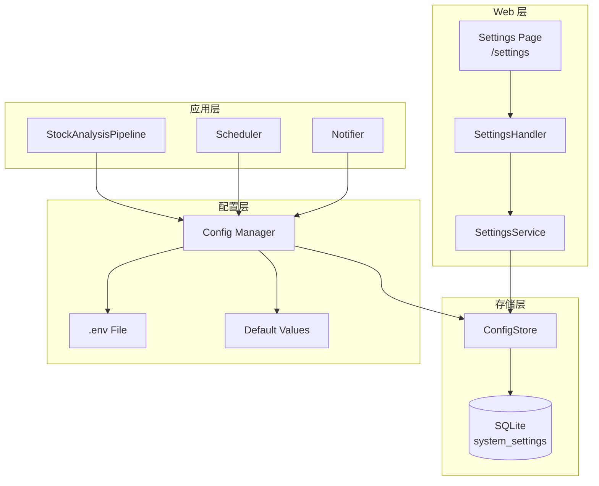

# 设计文档

## 概述

本设计为 A股自选股智能分析系统添加 WebUI 配置页面功能。核心目标是将 .env 文件配置迁移到网页界面，降低用户配置门槛。

设计遵循现有项目架构：
- 使用 SQLAlchemy ORM 进行数据库操作
- 复用现有 Web 模块分层架构（handlers → services → templates）
- 保持与现有 `src/config.py` 的兼容性

## 架构



## 组件与接口

### 1. SystemSetting 数据模型

新增 SQLAlchemy ORM 模型，存储系统配置。

```python
class SystemSetting(Base):
    """系统配置表"""
    __tablename__ = 'system_settings'
    
    id: int              # 主键
    key: str             # 配置键（唯一索引）
    value: str           # 配置值（加密存储敏感字段）
    is_encrypted: bool   # 是否加密
    category: str        # 分类（api_keys, email, schedule, stocks）
    description: str     # 描述
    created_at: datetime
    updated_at: datetime
```

### 2. ConfigStore 配置存储服务

负责配置的持久化读写，包含加密/解密逻辑。

```python
class ConfigStore:
    """配置存储服务"""
    
    # 敏感字段列表（需要加密）
    SENSITIVE_KEYS = {
        'gemini_api_key', 'tushare_token', 
        'tavily_api_keys', 'serpapi_keys',
        'email_password', 'openai_api_key'
    }
    
    def get(key: str) -> Optional[str]:
        """获取单个配置值"""
        
    def get_all(category: str = None) -> Dict[str, str]:
        """获取所有配置（可按分类过滤）"""
        
    def set(key: str, value: str, category: str = 'general') -> None:
        """设置单个配置"""
        
    def set_batch(configs: Dict[str, str], category: str) -> None:
        """批量设置配置"""
        
    def delete(key: str) -> None:
        """删除配置"""
        
    def _encrypt(value: str) -> str:
        """加密敏感值（使用 Fernet 对称加密）"""
        
    def _decrypt(value: str) -> str:
        """解密敏感值"""
```

### 3. ConfigManager 配置管理器

修改现有 `src/config.py`，实现配置加载优先级。

```python
class Config:
    @classmethod
    def _load_from_env(cls) -> 'Config':
        """
        配置加载优先级：
        1. 数据库配置（ConfigStore）
        2. .env 文件
        3. 代码默认值
        """
        
    def reload(self) -> None:
        """重新加载配置（运行时刷新）"""
```

### 4. SettingsHandler 设置页面处理器

处理设置页面的 HTTP 请求。

```python
class SettingsHandler:
    """设置页面处理器"""
    
    def handle_settings_page() -> Response:
        """GET /settings - 渲染设置页面"""
        
    def handle_save_api_keys(form_data: Dict) -> Response:
        """POST /settings/api-keys - 保存 API Keys"""
        
    def handle_save_stocks(form_data: Dict) -> Response:
        """POST /settings/stocks - 保存自选股"""
        
    def handle_save_email(form_data: Dict) -> Response:
        """POST /settings/email - 保存邮件配置"""
        
    def handle_save_schedule(form_data: Dict) -> Response:
        """POST /settings/schedule - 保存定时任务配置"""
        
    def handle_test_email(form_data: Dict) -> Response:
        """POST /settings/test-email - 测试邮件发送"""
```

### 5. SettingsService 设置业务服务

封装设置相关的业务逻辑。

```python
class SettingsService:
    """设置业务服务"""
    
    def get_all_settings() -> Dict[str, Any]:
        """获取所有设置（用于页面渲染）"""
        
    def save_api_keys(keys: Dict[str, str]) -> bool:
        """保存 API Keys"""
        
    def save_stock_list(stocks: str) -> str:
        """保存自选股列表（同时更新 .env）"""
        
    def save_email_config(config: Dict[str, str]) -> bool:
        """保存邮件配置"""
        
    def save_schedule_config(config: Dict[str, str]) -> bool:
        """保存定时任务配置"""
        
    def test_email_send() -> Tuple[bool, str]:
        """测试邮件发送"""
        
    def mask_sensitive_value(value: str) -> str:
        """掩码敏感值（如 sk-****xxxx）"""
```

## 数据模型

### system_settings 表结构

| 字段 | 类型 | 说明 |
|------|------|------|
| id | INTEGER | 主键，自增 |
| key | VARCHAR(100) | 配置键，唯一索引 |
| value | TEXT | 配置值（敏感字段加密） |
| is_encrypted | BOOLEAN | 是否加密，默认 False |
| category | VARCHAR(50) | 分类：api_keys, email, schedule, stocks |
| description | VARCHAR(255) | 配置描述 |
| created_at | DATETIME | 创建时间 |
| updated_at | DATETIME | 更新时间 |

### 配置键定义

| 分类 | 配置键 | 说明 | 加密 |
|------|--------|------|------|
| api_keys | gemini_api_key | Gemini API Key | ✓ |
| api_keys | tavily_api_keys | Tavily API Keys（逗号分隔） | ✓ |
| api_keys | serpapi_keys | SerpAPI Keys（逗号分隔） | ✓ |
| api_keys | tushare_token | Tushare Token | ✓ |
| stocks | stock_list | 自选股列表（逗号分隔） | ✗ |
| email | email_sender | 发件人邮箱 | ✗ |
| email | email_password | 邮箱密码/授权码 | ✓ |
| email | email_receivers | 收件人列表（逗号分隔） | ✗ |
| schedule | schedule_enabled | 定时任务启用状态 | ✗ |
| schedule | schedule_time | 执行时间（如 09:30,15:30） | ✗ |
| schedule | market_review_enabled | 大盘复盘启用状态 | ✗ |

### 加密方案

使用 `cryptography` 库的 Fernet 对称加密：

```python
from cryptography.fernet import Fernet
import base64
import hashlib

def get_encryption_key() -> bytes:
    """
    生成加密密钥
    基于机器特征生成固定密钥，确保重启后可解密
    """
    # 使用数据库路径作为盐值
    salt = get_config().database_path.encode()
    # 生成 32 字节密钥
    key = hashlib.pbkdf2_hmac('sha256', b'stock-analysis-secret', salt, 100000)
    return base64.urlsafe_b64encode(key)
```


## 正确性属性

*正确性属性是系统在所有有效执行中应保持为真的特征或行为——本质上是关于系统应该做什么的形式化陈述。属性作为人类可读规范和机器可验证正确性保证之间的桥梁。*

### Property 1: 敏感配置加密 Round-Trip

*For any* 敏感配置值（API Key、密码等），保存到数据库后再读取，应返回与原始值完全相同的内容。

**Validates: Requirements 1.3, 1.4**

### Property 2: 配置加载优先级

*For any* 配置键，如果数据库中存在该配置，则返回数据库值；如果数据库不存在但 .env 存在，则返回 .env 值；否则返回默认值。

**Validates: Requirements 2.1, 2.2, 2.3**

### Property 3: 敏感值掩码格式

*For any* 长度大于 4 的敏感值字符串，掩码后应保留前 2 个字符和后 4 个字符，中间用 `****` 替代。

**Validates: Requirements 3.2, 5.2**

### Property 4: 配置保存与删除

*For any* 配置键，保存非空值后应能读取到该值；保存空值后该配置应被删除（读取返回 None）。

**Validates: Requirements 3.3, 3.4**

### Property 5: 自选股双写一致性

*For any* 自选股列表，保存后数据库中的值和 .env 文件中的值应相同。

**Validates: Requirements 4.3**

### Property 6: 股票代码格式验证

*For any* 字符串，如果是 6 位数字则验证通过，否则验证失败。

**Validates: Requirements 4.2**

## 错误处理

### 数据库错误

| 错误场景 | 处理方式 |
|---------|---------|
| 数据库连接失败 | 回退到 .env 配置，记录警告日志 |
| 表不存在 | 自动创建表（SQLAlchemy ORM） |
| 写入失败 | 返回错误信息，保留用户输入 |

### 加密错误

| 错误场景 | 处理方式 |
|---------|---------|
| 解密失败（密钥变更） | 返回空值，记录错误日志 |
| 加密库不可用 | 明文存储，记录警告日志 |

### 表单验证错误

| 错误场景 | 处理方式 |
|---------|---------|
| 股票代码格式错误 | 显示错误提示，保留用户输入 |
| 邮箱格式错误 | 显示错误提示，保留用户输入 |
| 时间格式错误 | 显示错误提示，保留用户输入 |

## 测试策略

### 单元测试

- ConfigStore 的 CRUD 操作
- 加密/解密功能
- 敏感值掩码函数
- 股票代码验证函数
- 配置优先级逻辑

### 属性测试

使用 `hypothesis` 库进行属性测试：

- **Property 1**: 生成随机敏感值，验证加密 round-trip
- **Property 2**: 生成随机配置场景，验证优先级逻辑
- **Property 3**: 生成随机长度字符串，验证掩码格式
- **Property 4**: 生成随机配置键值，验证保存/删除逻辑
- **Property 5**: 生成随机股票列表，验证双写一致性
- **Property 6**: 生成随机字符串，验证股票代码验证

每个属性测试运行至少 100 次迭代。

### 集成测试

- 设置页面渲染测试
- 表单提交流程测试
- 配置变更后调度器重载测试
- 邮件测试发送功能测试
